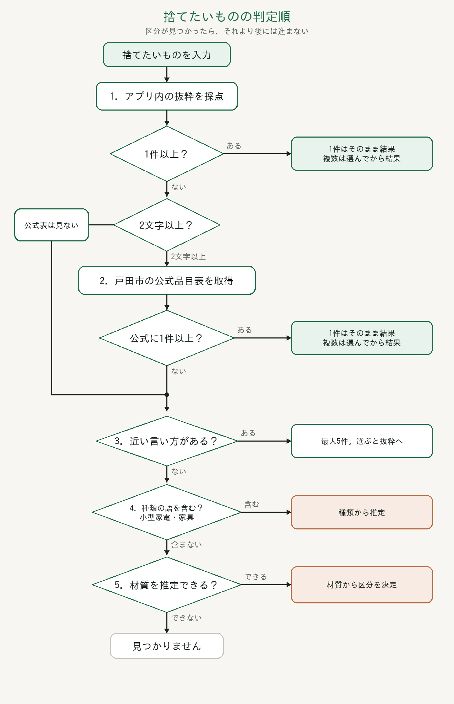

# 戸田市のごみ分別アプリ

戸田市の家庭ごみについて、地区を選び「捨てたいもの」を入れると、区分・収集曜日・出し方を一画面で出します。

戸田市の公式アプリではありません。登録もログインも不要です。最終判断は市の案内を確認してください。

## 出典

- [家庭ごみの正しい分け方・出し方について](https://www.city.toda.saitama.jp/soshiki/212/kankyo-cl-gomi.html)（令和8年度。2026年3月31日更新）
- [令和8年度 家庭ごみの正しい分け方・出し方（PDF）](https://www.city.toda.saitama.jp/uploaded/attachment/78306.pdf)
- [令和8年度 ごみ収集日一覧表（PDF）](https://www.city.toda.saitama.jp/uploaded/attachment/78679.pdf)
- [判断に迷う家庭ごみの分け方・出し方](https://www.city.toda.saitama.jp/soshiki/212/kankyo-cl-gomi-list.html)（2026年4月1日更新）
- [粗大ごみについて](https://www.city.toda.saitama.jp/soshiki/212/kankyo-cl-sodainitsuite.html)

アプリ内の品目は、上の案内からよく出るものを手で抜粋したものです。五十音表の全件ではありません。抜粋にない名前は、その場で公式の品目表を引きます。

地区は町名の組み合わせで6グループです。川岸は1・2丁目と3丁目でグループが違います。収集は当日朝8時までです。休止は勤労感謝の日と12月31日〜1月3日です。

## 捨てたいものの照合順

入力は前後の空白を除き、カタカナをひらがなにそろえてから、5つの段をこの順で見ます。区分が見つかった段で止まり、後の段には進みません。

1. アプリ内の抜粋
2. 戸田市の公式品目表
3. 近い言い方
4. 種類からの推定
5. 材質からの推定

1文字の入力は2段目を飛ばして3段目へ進みます。公式表の取得に失敗したときも、3段目へ進みます。3で候補があれば4には進みません。候補がなければ4、4で決まらなければ5です。近い言い方を選ぶと、選んだ名前で1段目から照合し直します。



### 1. アプリ内の抜粋

`src/data/toda.ts` の品目名と別名を点数の高い順に見ます。同じ品目に複数の点が付いたときは、いちばん高い点だけを残します。上位8件までです。

| 条件 | 点 |
| --- | --- |
| 品目名と完全一致 | 100 |
| 別名と完全一致 | 90 |
| 登録語が入力で始まる（入力が2文字以上） | 80 |
| 登録語の端に入力がある（入力が2文字以上） | 50 |
| 入力が品目名を含む（品目名が3文字以上） | 40 |
| 入力が別名を含む（別名が3文字以上） | 30 |

「端」とは、登録語の先頭か末尾です。直前の文字が「ー」のときは一致にしません（「ペット」が「カーペット」に当たるのを避けるためです）。

- 1件なら、その区分・曜日・出し方を出します。
- 2件以上なら、選んでもらってから出します。

### 2. 戸田市の公式品目表

抜粋が0件のときだけ、サーバーが次のページを取得します。入力が2文字未満のときは問い合わせません。

https://www.city.toda.saitama.jp/soshiki/212/kankyo-cl-gomi-list.html

取得結果は約6時間メモリに残します。品目名だけで比べ、上位8件までです。

| 条件 | 点 |
| --- | --- |
| 品目名と完全一致 | 100 |
| 品目名が入力で始まる | 80 |
| 品目名が入力を含む | 50 |
| 入力が品目名を含む（品目名が2文字以上） | 40 |

収集日の文言から、地区の曜日を次の順で決めます。先に当てはまったものを使います。

1. 「収集しません」
2. 「申込」→ 粗大ごみ
3. 「もやさない」
4. 「もやす」
5. 「資源」

1件なら結果を出します。複数なら選んでもらいます。画面には、戸田市の品目表から取った旨を書きます。

### 3. 近い言い方

1と2で区分が決まらないとき、抜粋の品目から候補を出します。入力が3文字未満なら候補はありません。

1. 入力を3文字ずつに切り、同じ3文字を持つ品目だけを残します。
2. 品目名と別名について、入力との最長の共通部分が3文字以上のものを残します。
3. 共通部分が長い順に、最大5件出します。

候補を選ぶと、その名前で1段目の抜粋から照合し直します。候補があるあいだは、種類の推定も材質の推定も出しません。

### 4. 種類からの推定

近い言い方が0件のとき、入力が次の語を含むかを見ます。長く一致した語を優先します。

| 種類 | 語 |
| --- | --- |
| 小型家電 | トースター、オーブントースター、加湿器、除湿機、空気清浄、ミキサー、ジューサー、コーヒーメーカー、電気ケトル、電気ポット、ホットプレート、アイロン、ヘアアイロン、シェーバー、かみそり、電動歯ブラシ、ラジオ、スピーカー、キーボード、マウス、電卓、ファンヒーター、電気ストーブ、こたつ、ルーター、ルータ、無線、モデム |
| 粗大ごみ | ベッド、学習机、本棚、食器棚、カーペット、スーツケース、ベビーベッド |

小型家電と推定したときは、次を出します。

- 40cm未満は、もやさないごみの日に本体だけを透明な袋へ入れ、赤いかごへ出します。
- 1辺が40cm以上は粗大ごみです。申込み案内も同じ画面に出ます。
- 「種類から『小型家電』と推定します」と表示し、戸田市の品目表にこの名前がないことも示します。

これは品目表の一致ではありません。

### 5. 材質からの推定

4段目で種類が決まらないときだけ、入力の文言から材質を推定して区分を一つ決めます。うちわ・団扇・扇子だけの特例ではありません。そこまで決まらなかった品目すべてが対象です。

1. 入力に材質の語があれば、その材質で決めます。長い語を優先します。
2. 材質の語がなければ、その品目のふつうの材質を推定します。入力に材質の語もあるときは、長いほうを使います。

| 入力から読む材質 | 区分 |
| --- | --- |
| プラスチック、ビニール、ポリエチレン、スチロール、樹脂、ナイロン | もやすごみ |
| 紙、木、木製、木材、竹、竹製、わら、藁 | もやすごみ |
| 布、繊維、綿、麻 | 布類（資源物） |
| 金属、鉄、ステンレス、アルミニウム、アルミ、針金、陶器、瀬戸物、陶磁器、ガラス | 不燃物等 |

材質の語が無い品目は、次のふつうの材質で決めます。

| 品目 | 推定する材質 | 区分 |
| --- | --- | --- |
| うちわ、団扇、扇子 | 紙・竹、またはプラスチック | もやすごみ |
| 割り箸、爪楊枝、楊枝、つまようじ、マッチ、鉛筆、色鉛筆、ボールペン、シャープペン、下敷き、くし、櫛 | 紙・木・竹、またはプラスチック | もやすごみ |

画面には、入力から推定した材質と、決めた区分を出します。どの材質にも当たらなければ、「近い言い方を選んでください」と出して終わります。

## 結果に出すもの

- 区分（もやすごみ、もやさないごみ、資源物、粗大ごみ、市では収集しない、など）
- 選んだ地区の収集曜日と、次の収集日（日本時間。朝8時を過ぎた当日は翌週以降）
- 出し方と注意
- 粗大ごみ、または40cm以上が粗大になりうる推定のときは、専用ダイヤルと戸田市公式LINEへのリンク

## 起動

```bash
npm install
npm run dev
```
